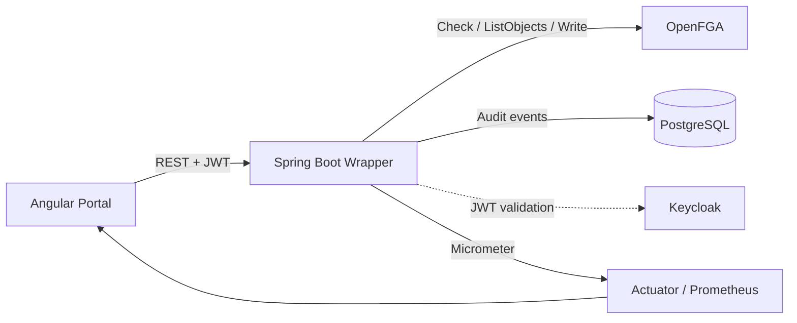

# Architecture

## Runtime flow

Nx is the **orchestrator**, not the Java or OpenFGA runtime. It gives the polyglot repository one task graph and consistent commands. Gradle remains authoritative for Java compilation/testing; Docker Compose remains authoritative for platform services.

## Backend boundaries

- `api`: HTTP transport and validation.
- `application`: use-case orchestration and transaction boundary.
- `domain`: authorization port and domain result.
- `infrastructure/openfga`: OpenFGA REST adapter.
- `infrastructure/persistence`: JPA audit persistence.
- `operations`: telemetry aggregation for the overview dashboard.

The wrapper intentionally prevents the Angular client from calling OpenFGA directly. This protects store/model identifiers, centralizes auditing, provides stable business APIs, and gives the service a place to apply timeouts, retries, metrics, and exception translation.

## Authentication versus authorization

Keycloak proves identity and issues a JWT. Spring Security validates the JWT. OpenFGA evaluates relationships. These are separate responsibilities: authentication answers **who**, authorization answers **may this subject perform this relation on this object**.
